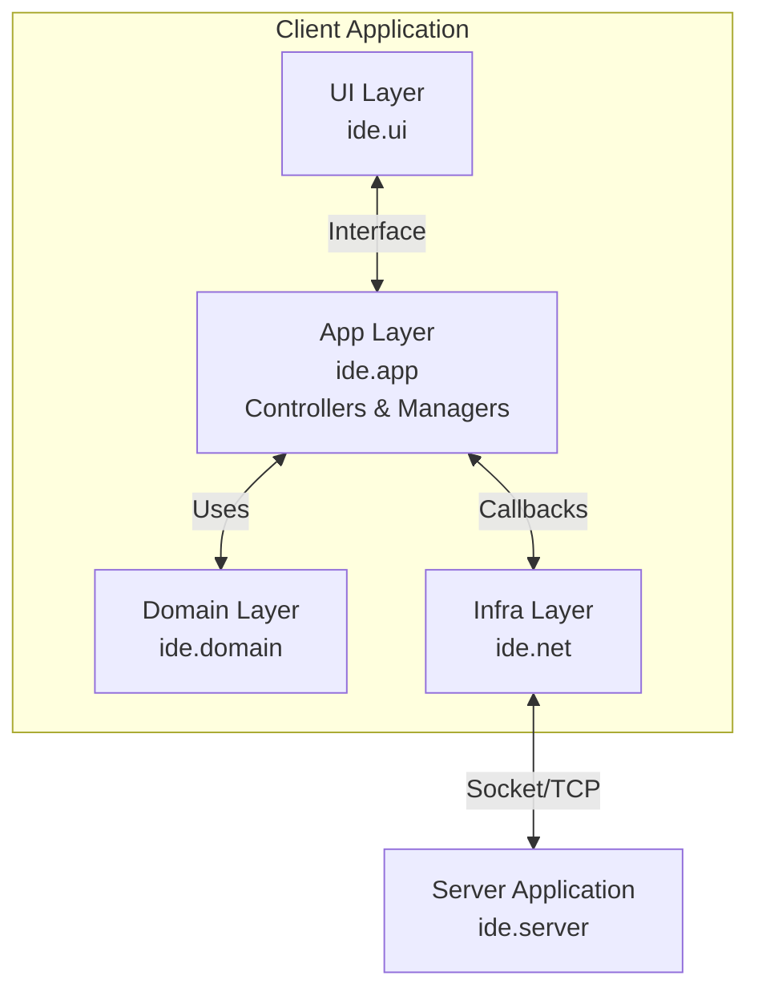

# 🚀 Java Socket Programming: SoCo(Socket Coding)

**한성대학교 네트워크 프로그래밍 과목 - 소켓 통신 프로젝트**
- 프로젝트명: SoCo
- 프로젝트 주제: 소켓 통신을 활용한 실시간 코딩 교육 IDE
- 프로젝트 설명: **SoCo**는 교수자가 학생들에게 실시간으로 코딩을 가르칠 수 있도록 설계된 교육용 실시간 코딩 교육 **IDE**입니다. 
이 프로젝트는 교수(Professor)와 학생(Student)의 역할을 명확히 구분하여 효율적인 원격 교육 환경을 제공하는 것을 목표로 합니다.
순수 자바 소켓(Java Socket)과 Swing을 사용하여 구현되었으며, 유지보수성과 확장성을 고려해 **계층형 아키텍처**와 **MVC 패턴**을 적용했습니다.

---

## 🏗 아키텍처 (Architecture)

이 프로젝트는 유지보수성과 확장성을 위해 **4계층 아키텍처**를 채택했습니다. 특히 **UI와 네트워크 로직의 완전한 분리**에 중점을 두었으며, 단일 책임 원칙(Single Responsibility Principle)을 준수하도록 설계되었습니다.

### 🏛 전체 시스템 구조도



### 📂 패키지별 상세 역할

| 계층 (Layer) | 패키지 | 역할 | 주요 클래스 |
| :--- | :--- | :--- | :--- |
| **Presentation** | `ide.ui` | **View**. 화면 렌더링 및 사용자 입력 처리 | `TabManager`, `FileTreeManager`, `ToolBarManager`, `AttendanceDialog`, `QuestionDialog` |
| **Application** | `ide.app` | **Controller**. UI와 네트워크 계층 조율 | `CollabIDE`, `ConnectionManager`, `UserSessionManager`, `UICoordinator` |
| **Domain** | `ide.domain` | **Model**. 순수 비즈니스 로직과 데이터 | `User`, `Role` |
| **Infrastructure** | `ide.net` | **Network Adapter**. 소켓 통신 수행 | `CollabClient`, `Protocol`, `CollabCallbacks` |
| **Server** | `ide.server` | **Server**. 멀티스레드 기반 중계 서버 | `CollabServer` |

---

## ✨ 핵심 기능 (Features)

### 1. 실시간 코드 동기화 (Real-time Code Sync)
- 교수자가 작성하는 코드가 모든 학생의 화면에 실시간으로 동기화
- 양방향 편집: 학생이 수정한 코드도 교수자에게 즉시 반영
- 파일 생성/삭제/이름 변경 등 프로젝트 구조 변경 실시간 전파

### 2. 원격 교육 도구 (Remote Teaching Tools)
- **레이저 포인터** 🔴: 교수자가 특정 코드 라인을 가리키면 학생들 화면에 붉은 점 표시
- **Follow Me (화면 동기화)** 👀: 교수자의 스크롤 위치에 학생들의 화면 자동 동기화
- **실시간 커서 위치 공유**: 각 참여자의 커서 위치를 색상으로 표시

### 3. 출석 관리 기능 (Attendance System) 
- **교수자 전용 기능**: 실시간 학생 출석 상태 확인
- 등록된 학생 명단과 접속 현황 매칭
- 시각적 상태 표시: 🟢 출석 / 🔴 결석
- 새로고침 버튼으로 최신 상태 갱신

### 4. 질문 기능 (Q&A System) 💬
#### 학생 (Student)
- "💬 질문하기" 버튼으로 교수자에게 질문 전송
- 텍스트 입력 다이얼로그를 통한 간편한 질문 작성

#### 교수자 (Professor)
- "💬 학생질문" 버튼으로 질문 목록 확인
- 실시간 질문 수신 및 자동 알림
- 시간, 학생명, 질문 내용이 테이블 형태로 표시
- 질문 내역 전체 삭제 기능

### 5. 역할 기반 UI (Role-Based UI)
- **Professor**: 출석부, 학생질문, 레이저 포인터, Follow Me 권한
- **Student**: 질문하기 버튼, 코드 작성/열람
- Role에 따른 자동 테마 변경 (교수자/학생 구분)

### 6. 프로젝트 관리
- 트리 구조의 파일 탐색기
- 파일/폴더 생성, 삭제, 이름 변경
- 여러 파일을 탭으로 동시 편집
- 자동 저장 및 수정 상태 표시
---
## 프로젝트 UI

### 교수자 화면

#### 1) IDE 메인 화면 · 출석부

<table>
  <tr>
    <td align="center">
      <b>교수자 IDE 메인 화면</b><br/>
      
    </td>
    <td align="center">
      <b>실시간 출석부 UI</b><br/>
      
    </td>
  </tr>
</table>

#### 2) 하이라이터 · 레이저 포인터

<table>
  <tr>
    <td align="center">
      <b>멀티 유저 하이라이터</b><br/>
      
    </td>
    <td align="center">
      <b>레이저 포인터 강조 화면</b><br/>
      
    </td>
  </tr>
</table>

---

### 학생 화면

#### 1) 학생 IDE 메인 화면

<p align="center">
  <b>학생용 IDE UI</b><br/>
  
</p>

#### 2) 질문 전송 · 질문 목록 UI

<table>
  <tr>
    <td align="center">
      <b>학생 질문 작성 화면</b><br/>
      
    </td>
    <td align="center">
      <b>교수자용 질문 목록 UI</b><br/>
      
    </td>
  </tr>
</table>


## 🛠 기술 스택 (Tech Stack)

- **Language**: Java 17+
- **GUI Library**: Java Swing (Custom UI Components)
- **Networking**: `java.net.Socket`, `java.net.ServerSocket` (Blocking I/O)
- **Architecture**: Layered Architecture + Client-side MVC + Manager Pattern
- **Design Patterns**: 
  - Single Responsibility Principle (SRP)
  - Interface Segregation (CollabActions, CollabCallbacks)
  - Dependency Injection (Manager classes)

---
## 🚀 실행 방법 (Getting Started)

프로젝트 루트에서 제공된 쉘 스크립트를 사용하여 간편하게 실행할 수 있습니다.

### 1. 서버 실행 (Server)
먼저 중계 서버를 실행해야 합니다.
```bash
./run-server.sh
```
- 기본 포트: 6000
- 클라이언트 연결 대기 및 메시지 브로드캐스팅

### 2. 클라이언트 실행 (Client)
새로운 터미널 창을 열고 클라이언트를 실행합니다. 여러 개를 실행하여 테스트할 수 있습니다.
```bash
./run-client.sh
```

### 3. 연결 설정
- **Host**: `127.0.0.1` (로컬) 또는 서버 IP
- **Port**: `6000`
- **Nickname**: 사용자 닉네임 (출석부와 매칭)
- **Role**: `Professor` 또는 `Student` 선택

### 4. 기능 사용 예시
```bash
# Terminal 1: 서버
./run-server.sh

# Terminal 2: 교수자
./run-client.sh
→ Connect 버튼 클릭
→ Nickname: prof, Role: Professor
→ "📋 Attendance" 버튼으로 출석 확인
→ "💬 학생질문" 버튼으로 질문 수신

# Terminal 3: 학생
./run-client.sh
→ Connect 버튼 클릭
→ Nickname: 송승윤, Role: Student
→ "💬 질문하기" 버튼으로 질문 전송
```

---

## 📁 프로젝트 폴더 구조

```text
SoCo/
├── ide/
│   ├── app/                    # [Application Layer]
│   │   ├── CollabIDE.java      # 메인 컨트롤러 
│   │   ├── CollabActions.java  # UI → Controller 인터페이스
│   │   ├── ConnectionManager.java   # 연결 관리 전담
│   │   ├── UserSessionManager.java  # 사용자 상태 관리
│   │   └── UICoordinator.java       # UI 조정 및 테마
│   │
│   ├── domain/                 # [Domain Layer]
│   │   ├── Role.java           # 역할 enum (PROFESSOR, STUDENT, GUEST)
│   │   └── User.java           # 사용자 도메인 객체
│   │
│   ├── net/                    # [Infrastructure Layer]
│   │   ├── CollabClient.java   # 네트워크 클라이언트
│   │   ├── CollabCallbacks.java # Network → Controller 인터페이스
│   │   └── Protocol.java       # 프로토콜 상수 정의
│   │
│   ├── server/                 # [Server Application]
│   │   └── CollabServer.java   # 멀티스레드 중계 서버
│   │
│   └── ui/                     # [UI Layer]
│       ├── TabManager.java     # 에디터 탭 관리
│       ├── FileTreeManager.java # 파일 트리 관리
│       ├── ToolBarManager.java  # 툴바 및 메뉴
│       ├── EditorTab.java      # 개별 에디터 탭
│       ├── LineNumberView.java # 줄 번호 표시
│       ├── AttendanceDialog.java # 출석 다이얼로그
│       ├── QuestionDialog.java   # 질문 목록 다이얼로그
│       ├── QuestionPanel.java    # 질문 표시 패널
│       └── Theme.java          # UI 테마 색상
│
├── out/                        # 컴파일된 클래스 파일
├── run-client.sh               # 클라이언트 실행 스크립트
├── run-server.sh               # 서버 실행 스크립트
└── README.md                   # 프로젝트 설명서
```

---

## 🎯 주요 설계 원칙

### 1. 관심사의 분리 (Separation of Concerns)
- **UI 계층**은 네트워크 코드를 전혀 모름
- **네트워크 계층**은 UI를 전혀 모름
- **Application 계층**이 중재자 역할 수행

### 2. 단일 책임 원칙 (Single Responsibility Principle)
- `ConnectionManager`: 연결 관리만 담당
- `UserSessionManager`: 사용자 상태 관리만 담당
- `UICoordinator`: UI 조정만 담당
- 각 클래스는 **하나의 명확한 책임**만 가짐

### 3. 인터페이스 분리
- `CollabActions`: UI → Controller 방향 통신
- `CollabCallbacks`: Network → Controller 방향 통신
- 의존성 역전을 통한 테스트 용이성 확보

---

## 프로토콜 명세 (Protocol Specification)

SoCo는 파이프(`|`) 구분자를 사용하는 텍스트 기반 프로토콜을 사용합니다.

| 메시지 타입 | 형식 | 설명 |
|------------|------|------|
| `JOIN` | `JOIN\|nickname\|role` | 서버 접속 시 전송 |
| `ROLE_INFO` | `ROLE_INFO\|nickname\|role` | 사용자 역할 정보 교환 |
| `EDIT` | `EDIT\|path\|Base64Content` | 파일 편집 동기화 |
| `CURSOR` | `CURSOR\|path\|dot\|mark\|nickname` | 커서 위치 동기화 |
| `VIEWPORT` | `VIEWPORT\|path\|line` | 스크롤 위치 동기화 |
| `LASER` | `LASER\|path\|x\|y` | 레이저 포인터 위치 |
| `FILE_CREATE` | `FILE_CREATE\|path\|isDir\|nickname` | 파일/폴더 생성 |
| `FILE_DELETE` | `FILE_DELETE\|path\|nickname` | 파일/폴더 삭제 |
| `FILE_RENAME` | `FILE_RENAME\|oldPath\|newPath\|nickname` | 이름 변경 |
| `QUESTION` | `QUESTION\|studentNick\|Base64QuestionText` | 학생 질문 전송 |

---

## 📝 코드 문서화 (Documentation)

### Javadoc 표준 주석

이 프로젝트의 모든 주요 클래스와 메소드는 **표준 Javadoc 형식의 한글 주석**으로 문서화되어 있습니다.
IDE에서 마우스를 올리면(Hover) 상세한 설명을 바로 확인할 수 있어 쉽게 이해할 수 있습니다.

### 주석 작성 규칙

#### 1. 클래스 주석
```java
/**
 * 네트워크 연결 라이프사이클을 관리하는 클래스.
 * 
 * 서버 연결, 연결 해제, 연결 상태 확인 등의 책임을 담당한다.
 */
public class ConnectionManager {
    // ...
}
```

#### 2. 메소드 주석
```java
/**
 * 서버에 연결한다.
 *
 * @param host 서버 호스트
 * @param port 서버 포트
 * @param nickname 닉네임
 * @param roleStr 역할 문자열
 * @throws IOException 연결 실패 시
 */
public void connect(String host, int port, String nickname, String roleStr) 
    throws IOException {
    // ...
}
```

#### 3. 필드 주석
```java
/** 현재 연결 상태 */
private boolean connected = false;

/** 사용자 역할 정보를 저장하는 맵 (닉네임 -> 역할) */
private final Map<String, Role> userRoles = new HashMap<>();
```

### IDE 지원

IntelliJ IDEA, Eclipse, VS Code 등 대부분의 IDE에서 Javadoc 주석을 자동으로 인식하여:
- 메소드 호출 시 매개변수 힌트 표시
- 클래스/메소드에 마우스 오버 시 설명 팝업
- 자동 완성 시 문서 표시

---
